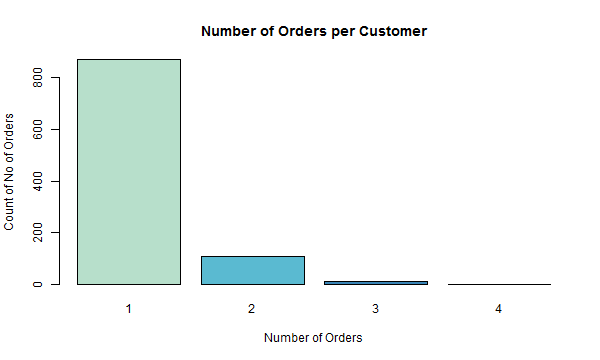
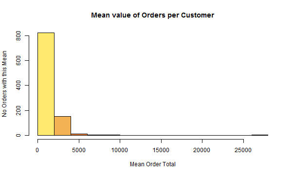

<style>
   h1 { font-size: 28px; }
   h2 { font-size: 24px; }
   h4 { margin-bottom: 0; color: #193441;}
   table h4 { margin-bottom: 0; padding-left: 1em;}
   table table { margin: 0 1em; width: auto; max-width: auto; }
   #TOC ul { list-style: none; }
   #TOC ul ul { list-style: square; }

   h4.date {
    font-size: 16px;
    color: #888;
    margin-bottom: 1em;
  }
</style>

```{r setup, include=FALSE}
knitr::opts_chunk$set(echo = FALSE, eval = TRUE, warning = FALSE)
options(scipen=1, digits=3)

set.seed(12345)
```

```{r init}
suppressWarnings( suppressMessages(library(tidyverse)) )
suppressWarnings( suppressMessages(library(tidytext)) )
suppressWarnings( suppressMessages(library(stringr)) )
suppressWarnings( suppressMessages(library(rvest)) )
suppressWarnings( suppressMessages(library(formattable)) )

# Replace specified values with new values, in a factor or character vector.
revalue <- plyr::revalue

# for the report I've run the loading and creation scripts so that when we look at the products and orders we can look at all the data 
# without having to scrape the website and do the processing. The code segments are included but not run, labeled with the NOT-RUN tag.

# Load the dataset from a stored object - orders, orders.items, product.details
load("data/starting_data.RData")
```

# Introduction

The project is to build a recommender system for [GetWine.co.za (http://www.getwine.co.za)](http://www.getwine.co.za), an online wine retailer. The data provided consists of a `r length(unique(orders$customers_id))` customers and their purchase orders for a selected period. Each order can consist of a number of items. Using this history and the details of the products we will construct and compare recommendation systems for use on the web site. To that end the recommendation systems might differ for each of the following scenarios:

## Scenarios

* <strong>As a user when I am viewing a products details, I would like to see recommendations of other products.</strong>
  <p>
    This scenario describes a new user (or existing user) that is visiting the site and _not_ signed into the system (not having used the login form or the cookie recognition of user details). In this case we do not know what their preferences are or what kind of products they might have purchased in the past.
    Our recommendation can ONLY be based on the product (attributes) being viewed and what other users might have bought in a similar situation.
  </p>
* <strong>As a _logged_ in user when I am viewing a product details, I would like to see recommendations of other products that matches my purchase history or tastes.</strong>
  <p>
    The user is already logged in (recognised by thet site) and from this we can determine their purchase history, the products that we recommend can then be influenced by their purchase history, taste profile, and/or the users details. This gives us the most information to create a more sofisticated recommendation system.
  </p>

# Dataset

The dataset as provided describes `r length(unique(orders$customers_id))` customers who combined have `r nrow(orders)` orders in a period between `r min(as.Date(orders$date_purchased))` and `r max(as.Date(orders$date_purchased))`. The orders consist of `r nrow(orders.items)` items ordered, each having around `r group_by(orders.items, orders_id) %>% summarise(count = n()) %>% summarise(avg = mean(count))` items. There are `r length(unique(orders.items$products_name))` unique products, some of which describe discounts, barter items which will have to be removed otherwise they could influence our product recommendations.

## Order Information

```{r load-dataset-NOT-RUN, eval = FALSE}

# Read in the order + items information
orders <- read.csv("orders.csv") %>% as.tibble() %>% 
            mutate(customer_age = as.numeric(difftime(as.Date("2017-09-01"), as.Date(customers_dob), unit="weeks"))/52.25)
orders.items <- read.csv("order-items.csv")  %>% as.tibble()
```


The order information consists of fields that describe the customer and the items they have ordered, the data is not in a structure that will allow the easy implementation of recommender models and so we will need to transform it and clean it, but first lets look at what fields they contain:

<table>
<tr>
  <td><h4>Order</h4></td>
  <td><h4>Order Item</h4></td>
</tr>
<tr>
<td>

Field | Description
------------- | -------------
customers_id | Unique id of a customer
customers_gender | The gender of the customer
customers_dob | Date of birth for that customer
customer_age | Current age of the customer
countries_name | Registration city of the customer
orders_id | Unique id of a order
date_purchased | Date of the order
payment_method | Payment method for this order
order_total | Total Value of the order
</td>
<td style="padding-left: 10px; vertical-align:top;">

Field | Description
------------- | -------------
orders_id | Unique order id
products_name | Name of the product
products_price | Price paid for the product
products_quantity | No of items purchased

</td>
</tr>
</table>

Cleaning the data we can remove the orders with a `order_total` value of 0 or less (barter), we can also remove all items with a `products_price` of 0 or less. We can then combine the orders and items into a single dataset that we can use as a data frame for all our recommendation models. In this case we are ignoring the `customers_dob` (because using `customer_age` should be easier to compare), `customers_gender` (because it is sparsely populated), `countries_name` (not taking location into account just yet), `date_purchased` and `payment_method` (because this can change for the same customer, so not really predictive).

```{r, eval = FALSE, echo = FALSE, message=FALSE, warning=FALSE, }
o <- orders %>% filter(order_total > 0) %>% group_by(customers_id) %>% summarise(no_orders = n(), mean_total = mean(order_total)) %>% arrange(desc(no_orders), desc(mean_total))

suppressWarnings(dir.create(path = "img/"));

png("img/o_no_orders.png", width = 600, height = 360)
barplot(table(o$no_orders), col = c("#B7DFCB","#5ABAD1","#3984B6","#264992","#161F63"), main="Number of Orders per Customer", mex = 0.8,
        xlab = "Number of Orders", ylab = "Count of No of Orders")
dev.off()

png("img/o_mean_total.png", width = 600, height = 360)
hist(o$mean_total, freq = T, col = c("#FDEA6F","#F3B355","#E97E3B","#CF4F29","#723C2C"), main="Mean value of Orders per Customer", mex = 0.8,
    xlab = "Mean Order Total", ylab = "No Orders with this Mean")
dev.off()
```
|||


The orders are also filtered to ignore any orders with `order_total <= 0` and `products_price <= 0`, some `products_name` values are changed so that it will find the correct product in the product dataset (next section).

```{r, message = FALSE}
orders.combined <- left_join(orders, orders.items) %>% 
                      filter(order_total > 0, products_price > 0, !grepl("Johan", products_name)) %>%
                      # filter(!grepl("Private Bin", products_name),
                      #        !grepl("Samarie Smith se", products_name),
                      #        !grepl("TOP SELLING", products_name),
                      #        !grepl("Clos Malverne Shiraz", products_name),
                      #        !grepl("Personalised Label", products_name),
                      #        !grepl("Devil's Peak", products_name)) %>%
                      select(customers_id, customer_age, orders_id, order_total, products_name, products_price, products_quantity) %>%
                      #group_by(customers_id, products_name, products_price) %>%
                      #summarise(products_quantity = sum(products_quantity)) %>%
                      arrange(products_name)

formattable(head(orders.combined), row.names = FALSE)
```

```{r}
orders.combined <- orders.combined %>% 
                  mutate(products_name = revalue(products_name, 
                  c("Raka Sauvignon Blanc" = "Raka Sauvignon Blanc 2017",
                  "Buitenverwachting Buiten Blanc 2016" = "Buitenverwachting Buiten Blanc",
                  "Vondeling Cabernet Sauvignon" = "Vondeling Cabernet Sauvignon 2014",
                  "Vondeling Cabernet Sauvignon case of 6 bottles" = "Vondeling Cabernet Sauvignon 2014",
                  "Theuniskraal Ixia Shiraz 2013" = " Theuniskraal Ixia Shiraz",
                  "Theuniskraal Ixia Shiraz 2016" = " Theuniskraal Ixia Shiraz",
                  "Villiera Sauvignon Blanc" = "Villiera Sauvignon Blanc 2016",
                  "Saronsberg Provenance Shiraz 2015" = "Saronsberg Provenance Shiraz",
                  "Raka Sauvignon Blanc 2016" = "Raka Sauvignon Blanc 2017",
                  "Diemersdal Sauvignon Blanc 2017" = "Diemersdal Sauvignon Blanc",
                  "Leopards Leap Merlot 2016" = "Leopards Leap Merlot",
                  "Haute Cabriere Chardonnay/Pinot Noir 2016" = "Haute Cabriere Chardonnay/Pinot Noir",
                  "Paradyskloof Grenache, Mourvédre & Shiraz 2015" = "Paradyskloof Grenache, Mourvédre & Shiraz 2015",
                  "Paradyskloof Grenaché Rosé 2016" = "Paradyskloof Grenache Rose 2016",
                  "De Grendel Rosé" = "De Grendel Rosé",
                  "Brampton Sauvignon Blanc 2016 - Veritas Gold" = "Brampton Sauvignon Blanc",
                  "Capaia Merlot/Cabernet Sauvignon 2014" = "Capaia Merlot/Cabernet Sauvignon",
                  "Cederberg Chenin Blanc 2016" = "Cederberg Chenin Blanc 2017",
                  "Theuniskraal Semillon/Chardonnay 2015" = "Theuniskraal Semillon/Chardonnay",
                  "Secateurs Chenin Blanc by Adi Badenhorst 2016" = "Secateurs Chenin Blanc by Adi Badenhorst",
                  "Allesverloren Vintage Port" = "Allesverloren Fine old Vintage Port",
                  "Cloof Dusty Road Pinotage" = "Cloof Dusty Road Pinotage 2016",
                  "Cloof Dusty Road Pinotage 2015" = "Cloof Dusty Road Pinotage 2016",
                  "Glen Carlou Haven Chardonnay case of 6 bottles" = "Glen Carlou Haven Chardonnay 2014",
                  "Theuniskraal Prestige Red Blend 2013" = "Theuniskraal Prestige Red Blend 2015",
                  "Vrede en Lust Lady J Syrah 2013" = "Vrede en Lust Lady J Syrah",
                  "Waterford Pecan Stream Pebble Hill 2013" = "Waterford Pecan Stream Pebble Hill",
                  "Ken Forrester Petit Pinotage 2015" = "Ken Forrester Petit Pinotage",
                  "Flagstone Truth Tree Pinotage 2015" = "Flagstone Truth Tree Pinotage",
                  "Asara Vineyard Collection Shiraz case of 6 bottles" = "Asara Vineyard Collection Shiraz 2012",
                  "Round House Cinsault Rose" = "Round House Cinsault Rosé 2017",
                  "Theuniskraal Ixia Cabernet Sauvignon" = "Theuniskraal Ixia Cabernet Sauvignon 2016",
                  "Remhoogte Chenin Blanc 2016" = "Remhoogte First Light Chenin Blanc 2016",
                  "Theuniskraal Ixia Shiraz" = "Theuniskraal Ixia Shiraz")))

orders.combined$products_name = as.character(orders.combined$products_name)
```


## Product Information

The only information that we have about the products is the name and price as provided by the order items table. To obtain more information we will have to refer to the website (If we had access to the product database this information can be obtained directly).

In most cases having a e-commerce website the various products and pages would be marked up into a standardised format for search engines to easily map the products to their respective pages. In this way when a user searching the web for a term that matches the name of your product the page link will be displayed in the search results and in so doing a new customer is introduced to your web site. Since early 2006 the major search engines have generally agreed to map sites using the Sitemap Protocol v0.9 ((https://www.sitemaps.org/index.html)[https://www.sitemaps.org/index.html]).

The Getwine web site has a sitemap defined at (http://www.getwine.co.za/sitemapblog.xml)[http://www.getwine.co.za/sitemapblog.xml] that follows this protocol and it includes a link to a PHP page that lists all the products (the `sitemapblog.xml` should really only contain links to the blog article and a separate `sitemap.xml` file should define a `urlset` for the site and a `url` element for each product; to properly conform to the protocol). In this case we can use the link (http://www.getwine.co.za/sitemap.php)[http://www.getwine.co.za/sitemap.php]) to give us a list of links to the products in the site.

Example Links extracted from the sitemap file:
<pre>
  A. <a href="http://www.getwine.co.za/index.php?main_page=product_info&cPath=22_2_18&products_id=29">Durbanville Hills Sauvignon Blanc</a>
  B. <a href="http://www.getwine.co.za/index.php?main_page=index&cPath=48_55">Red Wines</a>
  C. <a href="http://www.getwine.co.za/index.php?main_page=blog_article&art_id=20">Getwine Personalised Labels</a>
</pre>

The structure of the link provides us with some useful information:

1. `products_id` refers to a unique identifier for that product.
2. `main_page` refers to where the page is located within the site, we are mostly interested in the `product_info` links.
3. the `cPath` parameter gives us a indication to the grouping that a product might have, using this and the the `main_page=index` key-value it is possible to construct a category and type definition for each product.

```{r read-website-NOT-RUN, eval = FALSE}

# read the website and construct the product.details object - more info in "get_product_information.R"

page.sitemap <- read_html("http://www.getwine.co.za/sitemap.php")

# save for later use
fileConn <- file("data/source_www.getwine.co.za_sitemap.php.html")
write(as.character(page.sitemap), fileConn)
close(fileConn)


# Select the links in the table but only those that point to product_info 
page.productLinks <- html_nodes(page.sitemap, css="tr td a[href*='product_info']")

regexp <- '.*<a.*href="(.*?)"*>(.*)<\\/a>.*';

page.links <- page.productLinks %>% 
  str_match(pattern = regex(regexp)) %>% .[,c(3,2)] %>% # select href and text from <a href="2">3</a> - swap
  data.frame(matrix(ncol=2, byrow=TRUE)) %>% 
  setNames(c("products_name", "rawlink", "empty1", "empty2")) %>% as.tibble() %>%
  mutate(link = str_replace_all(string = rawlink, pattern = "amp;", replacement = "")) %>% 
  select(products_name, link)


# Web scrape the products from the site for each of the products in our list
# then save it to a file for later easy access.
for(j in 1:as.numeric(count(page.links))) {
  
  prod_id <- str_extract(page.links[j,]$link, "(\\d*)$")
  destfile <- paste0("data/products/", prod_id ,".html")
  
  if(!file.exists(destfile)) {  

    raw <- read_html(as.character(page.links[j,]$link))
    
    fileConn <- file(destfile)
    write(as.character(raw), fileConn)
    close(fileConn)
  }
}

# Extract the details from a page

is.blank <- function(x, false.triggers=FALSE){
  if(is.function(x)) return(FALSE) # Some of the tests below trigger
  # warnings when used on functions
  return(
    is.null(x) ||                # Actually this line is unnecessary since
      length(x) == 0 ||            # length(NULL) = 0, but I like to be clear
      all(is.na(x)) ||
      all(x=="") ||
      (false.triggers && all(!x))
  )
}

# Extract the details from a page
tmp <- data.frame()

page.links.clean <- mutate(page.links, keep = !(prod_id %in% c(10438, 6589, 6607, 1435, 1436, 1437, 1439, 1440, 10633, 10521, 10635))) %>% filter(keep)

for(j in 1:as.numeric(count(page.links.clean))) {
  
  prod_id <- str_extract(page.links.clean[j,]$link, "(\\d*)$")
  prod_path <- str_extract(page.links.clean[j,]$link, "\\d+(_\\d+(_\\d+)?)?") %>% str_split("_") %>% unlist()
  
  category <- product.lookup[product.lookup$path == prod_path[1],]$name
  type   <- ifelse(length(prod_path) >= 2, product.lookup[product.lookup$path == paste0(prod_path[1],"_",prod_path[2]), ]$name, "")
  flavor <- ifelse(length(prod_path) >= 3, product.lookup[product.lookup$path == paste0(prod_path[1],"_",prod_path[2],"_",prod_path[3]), ]$name, "")
  
  raw <- read_html(paste0("data/products/", prod_id ,".html"))
  
  name <- html_nodes(raw, css = ".product-info h1") %>% html_text(trim = TRUE)
  breadcrumbs <- html_nodes(raw, css = "#breadcrumbs a") %>% html_text(trim = TRUE)
  discount <- html_nodes(raw, css = ".product-info .productPriceDiscount")  %>% html_text(trim = TRUE) %>% str_extract("\\d{2,5}")
  description <- html_nodes(raw, css = ".product-info .product-description") %>% html_text(trim = TRUE)
  recommendation <- html_nodes(raw, css = ".productListing-data p") %>% html_text(trim = TRUE)
  
  price <- html_nodes(raw, css = ".product-details .productPrice") %>% html_text(trim = TRUE) %>% str_extract("\\d+$")
  priceSpecial <- html_nodes(raw, css = ".product-details .productSpecialPrice") %>% html_text(trim = TRUE) %>% str_extract("\\d+$")
  
  if (length(discount) == 0) discount <- 0;             # might be not defined so discount is 0
  
  r1 <- NA
  r2 <- NA
  r3 <- NA
  
  if (length(recommendation) > 0) {
    r1 <- recommendation[1]
    r2 <- recommendation[2]
    r3 <- recommendation[3]
  }

  this_product <- data.frame(prod_id = prod_id,
                             name = name,
                             category = category,
                             type = ifelse(type == "", NA, type),
                             flavor = ifelse(flavor == "", NA, flavor),
                             price = ifelse(is.blank(price), ifelse(is.blank(priceSpecial), NA, priceSpecial), price),
                             discount = ifelse(is.blank(discount), 0, discount), 
                             description = description, 
                             r1 = r1, r2 = r2, r3 = r3,
                             stringsAsFactors = FALSE)
  
  tmp <- rbind.data.frame(tmp, this_product)
}

product.details <- left_join(tmp, mutate(tmp, prod_rec1 = prod_id, r1_name = name) %>% select(prod_rec1, r1_name), by = c("r1" = "r1_name")) %>% 
  left_join(mutate(tmp, prod_rec2 = prod_id, r2_name = name) %>% select(prod_rec2, r2_name), by = c("r2" = "r2_name")) %>%
  left_join(mutate(tmp, prod_rec3 = prod_id, r3_name = name) %>% select(prod_rec3, r3_name), by = c("r3" = "r3_name")) %>%
  select(-r1, -r2, -r3) %>% as.tibble()

product.details$prod_id <- as.factor(product.details$prod_id)
product.details$category <- as.factor(product.details$category)
product.details$type <- as.factor(product.details$type)
product.details$flavor <- as.factor(product.details$flavor)


# save all the order info
save(orders, orders.items, page.links, product.lookup, product.details, file = "data/starting_data.RData")
```

Out of the sitemap page we can get `r nrow(page.links)` links, unfortunately probably due to products being loaded and moved around from group to group and because we are using the names to match against order items we need to remove the `r nrow(filter(page.duplicateLinks, !keep))` duplicate links that exist in this dataset. Fortunately they are few enough to manually decide which to keep.

```{r knit-err-NOT-RUN, eval = FALSE}
page.duplicateLinks <- page.links[duplicated(page.links$products_name) | duplicated(page.links$products_name, fromLast = TRUE), ]
page.duplicateLinks[ page.duplicateLinks$prod_id %in% c(10438, 6589, 6607, 1435, 1436, 1437, 1439, 1440, 10633, 10521, 10635), ]$keep = FALSE
```

```{r}
formattable(arrange(page.duplicateLinks, products_name, prod_id), row.names = FALSE)
```
The product details now contain `r nrow(product.details)` products in `r length(levels(product.details$category))` categories and `r length(levels(product.details$type))` types. The categories consist of:

```{r}

formattable(group_by(product.details, category) %>% summarise(count = n()), row.names = FALSE)

```

Removing some of these categories will help to reduce the list of products to the same type and help to give a more accurate recommendation for a particular wine. These categories will be removed _Gifts_, _Gift Vouchers_, _Personalised Labels_, _Miscellaneous - Sundries_, _Miscellaneous - Wine_ and _Craft Beer_. The _Mixed Cases_ describe wines that are combined into a case that can be bought and it is difficult at this point to map the wines contained in each box to a particular product in our list, so for now we will also remove the products that fall into this category.

```{r step1}
# removing categories we don't want
product.details.step1 <- filter(product.details, !(category %in% c("Mixed Cases","Gift Vouchers","Gifts", "Personalised Labels", "Miscellaneous - Sundries", "Miscellaneous - Wine", "Craft Beer")))

formattable(group_by(product.details.step1, category) %>% summarise(count = n()), row.names = FALSE)
```

This leaves us with `r nrow(product.details.step1)` products, the category can be simplified by creating a new variable for `labelled` and `special` and `organic` taking into account that a `organic` wine is also labelled and could be marked as special.

```{r step2}

product.details.step2 <- mutate(product.details.step1, 
                                labelled = ifelse( str_detect(category, "Labelled"), str_detect(category, "Labelled"), str_detect(category, "Organic")), #organic wines are also all labelled
                                special = str_detect(category, "Specials"), 
                                organic = str_detect(category, "Organic"))

tmp <- group_by(product.details.step2, labelled) %>% summarise(count = n()) %>% mutate(name = paste0("Labelled - ",labelled)) %>% select(name, count) %>%
union(group_by(product.details.step2, organic) %>% summarise(count = n()) %>% mutate(name = paste0("Specials - ",organic)) %>% select(name, count)) %>%
union(group_by(product.details.step2, special) %>% summarise(count = n()) %>% mutate(name = paste0("Organic - ",special)) %>% select(name, count)) %>% arrange(name)

formattable(tmp, row.names = FALSE)
```

Reviewing the product types, which we obtained from the `cPath` parameter, it is clear we need to filter and merge some of the types. For example the `Red Wines` type should be the same as `Red Wine`. (The single *Veritas Winners* wine is also a red wine in this case)

```{r}
formattable(head(group_by(product.details.step2, type) %>% summarise(count = n()), n = 30), row.names = FALSE)
```

```{r step3}

product.details.step3 <- product.details.step2
product.details.step3 <- product.details.step3 %>% 
                          mutate(type = revalue(type, c("Red Wines" = "Red Wine"))) %>%
                          mutate(type = revalue(type, c("Veritas Winners" = "Red Wine"))) %>%
                          mutate(type = revalue(type, c("White Wines" = "White Wine"))) %>%
                          mutate(type = revalue(type, c("Rose Wines" = "Rose Wine")))

#formattable(group_by(product.details.step3, type) %>% summarise(count = n()), row.names = FALSE)
```
```{r step4}
tmp <- filter(product.details.step3, is.na(type)) %>% select(prod_id,name, type, flavor, price, discount, labelled, special, organic ) %>% head(n = 15)
formattable(tmp, row.names = FALSE)

product.details.step3$type <- as.character(product.details.step3$type)
product.details.step3$flavor <- as.character(product.details.step3$flavor)

product.details.step4 <- product.details.step3 %>% 
                          mutate(type = ifelse(prod_id == "1205", "Red Wine", type), flavor = ifelse(prod_id == "1205", "Red Blend", flavor)) %>%
                          mutate(type = ifelse(prod_id == "1226", "Red Wine", type), flavor = ifelse(prod_id == "1226", "Shiraz", flavor)) %>%
                          mutate(type = ifelse(prod_id == "1200", "Red Wine", type), flavor = ifelse(prod_id == "1200", "Cabernet Sauvignon", flavor)) %>%
                          mutate(type = ifelse(prod_id == "1225", "Red Wine", type), flavor = ifelse(prod_id == "1225", "Cabernet Sauvignon", flavor)) %>%
                          mutate(type = ifelse(prod_id == "1203", "Red Wine", type), flavor = ifelse(prod_id == "1203", "Pinot Noir", flavor)) %>%
                          mutate(type = ifelse(prod_id == "1235", "White Wine", type), flavor = ifelse(prod_id == "1235", "Chardonnay", flavor)) %>%
                          mutate(type = ifelse(prod_id == "1224", "Red Wine", type), flavor = ifelse(prod_id == "1224", "Pinotage", flavor)) %>%
                          mutate(type = ifelse(prod_id == "1202", "Red Wine", type), flavor = ifelse(prod_id == "1202", "Shiraz", flavor)) %>%
                          mutate(type = ifelse(prod_id == "1209", "Red Wine", type), flavor = ifelse(prod_id == "1209", "Shiraz", flavor)) %>%
                          mutate(type = ifelse(prod_id == "1214", "White Wine", type), flavor = ifelse(prod_id == "1214", "Chardonnay", flavor)) %>%
                          mutate(type = ifelse(prod_id == "1217", "Red Wine", type), flavor = ifelse(prod_id == "1217", "Cabernet Sauvignon", flavor)) %>%
                          mutate(flavor = ifelse(type == "Rose Wine", "Rose", flavor)) %>%
                          mutate(flavor = ifelse(type == "Rosé Wine", "Rosé", flavor))

no_flavor <- nrow(filter(product.details.step4, is.na(flavor)))

product.details.step4 <- product.details.step4 %>% 
  mutate(flavor = revalue(flavor, c("Red Blends" = "Red Blend"))) %>% 
  mutate(flavor = revalue(flavor, c("Shiraz/Syrah" = "Shiraz"))) %>%
  mutate(flavor = revalue(flavor, c("Riesling/Gewürztraminer" = "Riesling")))

```
There are still `r nrow(filter(product.details.step3, is.na(type)))` wines that have the wrong type assigned (they all have an invalid `cPath` parameter e.g `cPath=22` which only maps to _`r product.lookup[product.lookup$path == "22",]$name`_), fortunately they are few enough to manually change.

Moving on to flavor, there are `r no_flavor` wines with no flavor value, which we can mostly fix by checking if some of the existing flavor values occur in the name.

```{r}
formattable(product.details.step4 %>% group_by(flavor) %>% summarise(count = n()), row.names = FALSE)
```

```{r step5-NOT-RUN, eval = FALSE, echo = FALSE}
product.details.step5 <- product.details.step4

flavor.levels <- as.character( levels(as.factor(product.details.step4$flavor)) ) %>% 
                  as.tibble() %>%
                  mutate(lookup = value) %>%
                  add_row(lookup = "Blanc", value = "Blanc") %>%
                  add_row(lookup = "Chenin/Sauvignon Blanc", value = "Chenin Blanc") %>%
                  add_row(lookup = "Brut", value = "Brut") %>%
                  add_row(lookup = "Pinot Gris", value = "Pinot Gris") %>%
                  add_row(lookup = "Vonkel", value = "Sparkling") %>%
                  add_row(lookup = "Gin", value = "Gin") %>%
                  add_row(lookup = "Red", value = "Red Blend") %>%
                  add_row(lookup = "Rooi", value = "Red Blend") %>%
                  add_row(lookup = "Blend", value = "Red Blend") %>%
                  add_row(lookup = "Spliced", value = "Red Blend") %>%
                  add_row(lookup = "Sherry", value = "Sherry") %>%
                  add_row(lookup = "Port", value = "Port") %>%
                  add_row(lookup = "Olive Oil", value = "Olive Oil") %>%
                  add_row(lookup = "Schnapps", value = "Schnapps") %>%
                  add_row(lookup = "Syrah", value = "Shiraz") %>%
                  add_row(lookup = "Ratafia", value = "Ratafia") %>%
                  add_row(lookup = "Monis Pale Dry", value = "Sherry")

for (i in 1:nrow(product.details.step5)) {

  found <- 0
  for(j in 1:nrow(flavor.levels)) {
    
    if (str_detect(product.details.step5[i,]$name, flavor.levels[j,]$lookup))  {
      found <- j
    }
  }
  
  if ((found > 0) && (is.na(product.details.step5[i,]$flavor))) {
    product.details.step5[i,]$flavor <- flavor.levels[found,]$value
  }
}


product.details.step5 <- product.details.step5 %>% 
  mutate(flavor = ifelse(type == "Red Wine", ifelse(is.na(flavor), "Red Blend", flavor), flavor)) %>%
  mutate(flavor = ifelse(type == "White Wine", ifelse(is.na(flavor), "White Blend", flavor), flavor)) %>%
  mutate(flavor = ifelse(type == "Sparkling Wines", ifelse(is.na(flavor), "Sparkling", flavor), flavor)) %>%
  mutate(flavor = ifelse(type == "Noble Late Harvest", ifelse(is.na(flavor), "Noble Late Harvest", flavor), flavor))
  #filter(is.na(flavor))

product.details.final <- select(product.details.step5, 
                                  prod_id, name, type, flavor, 
                                  price, discount, 
                                  labelled, special, organic, 
                                  prod_rec1, prod_rec2, prod_rec3) #,description)

product.details.final$type <- as.factor(product.details.step5$type)
product.details.final$flavor <- as.factor(product.details.step5$flavor)


# save product.details.final
save(orders, orders.items, page.links, product.lookup, product.details, product.details.final, page.duplicateLinks, file = "data/starting_data.RData")
```

The cleaned product details now contain a list of proper flavors:
```{r}
formattable(product.details.final %>% group_by(flavor) %>% summarise(count = n()), row.names = FALSE)
```

And all the types are defined:

```{r}
formattable(product.details.final %>% group_by(type) %>% summarise(count = n()), row.names = FALSE)
```

A summary of the dataset gives us some insight into what fields we can use for the recommender system:
```{r}
summary(product.details.final)
```

The final products dataset contains the following fields:

Field | Description
------------- | -------------
prod_id | Unique id for the product
name | Name of the product
type | Type of the product
flavor | Flavor description of the product
price | Price of the product
discount | Discount value for the product
labelled | Is this product labelled
special | Is this product on special
organic | Is this product organic
prod_rec1-3 | Web site recommended product in relation to this one

Before we join the products to the orders we need to clean up some of the order item names

# Recommendation Systems

```{r}

orders.valid <- orders.combined %>%
                # filter(!(products_name %in% 
                #            c("Personalised Mixed Case", 
                #              "Clos Malverne Shiraz 2014", 
                #              "Hemel en Aarde Ridge Private Bin Shiraz 2016 unlabelled",
                #              "Hemel en Aarde Ridge Private Bin Shiraz 2016",
                #              "Simonsig Adelberg Cabernet Merlot 2013",
                #              "Hermanuspietersfontein Nr.3 Sauvignon Blanc 2015",
                #              "La Couronne Dry Red Blend NV unlabelled",
                #              "Paradyskloof Grenache Rose 2016",
                #              "Fleur du Cap Shiraz, 2015",
                #              "Fleur du Cap Shiraz, Grenache, Cinsault 2015",
                #              "Zevenwacht Sauvignon Blanc 2016",
                #              "The Fresh Man Sauvignon Blanc 2016 - By Rianie Strydom",
                #              "Paradyskloof Red Blend 2015",
                #              "Budget Red || 12 Assorted",
                #              "Budget Mixed || Assorted White & Red",
                #              "Louisvale Unwooded Chardonnay 2015",
                #              "Louisvale Wooded Chardonnay 2014",
                #              "Croydon Title Deed Cape Blend 2015",
                #              "Thelema Sauvignon Blanc 2016",
                #              "Devil's Peak Pale Ale 340ml",
                #              "LOUIS COETZEE's CRAFT BEER Case",
                #              "JORDAN Lifestyle Case 12-pack",
                #              "Budget Red || 12 Assorted",
                #              "Budget Mixed || Assorted White & Red",
                #              "Luxury Red || Assorted",
                #              "Budget White || Sauv Blanc's",
                #              "Devil's Peak First Light Golden Ale 340ml",
                #              "Devil's Peak Alpha Ginger Cider 340ml",
                #              "Devil's Peak Alpha Lager 340ml",
                #              "Citizen Saboteur English IPA 440ml",
                #              "Constantia Uitsig Chardonnay Reserve 2014",
                #              "Constantia Uitsig Natura Vista 2014"))) %>%
                left_join(product.details.final, by = c("products_name" = "name"))

# not mapped to product   
orders.invalid <- orders.valid %>% filter(is.na(prod_id))
orders.valid <- orders.valid %>% filter(!is.na(prod_id))
```

Taking the order items and then joining them to our selected products we now have a dataset that combines valid products (that can be sold) with the items that customers have ordered, and that we are interested in, now when we make a proper recommendation. 

<table class="table table-condensed">
<tr>
<td rowspan="2"><strong>Order Items</strong></td>
<td>Valid</td>
<td>`r nrow(orders.valid)`</td>
</tr>
<tr>
<td>Invalid</td>
<td>`r nrow(orders.invalid)`</td>
</tr>
<tr>
<td><strong>No of Orders</strong></td>
<td></td>
<td>`r length(unique(orders.valid$orders_id))`</td>
</tr>
<tr>
<td><strong>No of Customers</strong></td>
<td></td>
<td>`r length(unique(orders.valid$customers_id))`</td>
</tr>
<tr>
<td><strong>No of Products</strong></td>
<td></td>
<td>`r length(unique(orders.valid$prod_id))`</td>
</tr>
</table>


```{r}

test.wines_products <- unique(orders.valid$prod_id)
test.wines_list <- as.integer(runif(5, 1, length(test.wines_products)))
#test.wines <- test.wines_products[test.wines_list]

test.wines <- c("5704", "5093", "10284", "9815", "10177") # selected a range of product id's with variable

test.customers_ids <- unique(orders.valid$customers_id)
test.customers_list <- as.integer(runif(5, 1, length(test.customers_ids)))
#test.customers <- test.wines_products[test.wines_list]

test.customers <- c("270", "1049", "38693", "42383", "18033") # test.customers_ids[ c(135,264,413,591,803) ] # for consistency
```

Selecting a product just by looking at it's popularity, i.e how many times it was bought in the selected period, this table shows us the top 10 products:
```{r}
# constructing producst X customer matrix
# brute force method

is.blank <- function(x, false.triggers=FALSE){
  if(is.function(x)) return(FALSE) # Some of the tests below trigger
  # warnings when used on functions
  return(
    is.null(x) ||                # Actually this line is unnecessary since
      length(x) == 0 ||            # length(NULL) = 0, but I like to be clear
      all(is.na(x)) ||
      all(x=="") ||
      (false.triggers && all(!x))
  )
}

order.matrix = matrix(0L, nrow = length(unique(orders.valid$customers_id)), ncol = length(unique(orders.valid$prod_id)))
row.names(order.matrix) = unique(as.character(orders.valid$customers_id)) %>% sort()
colnames(order.matrix) = unique(as.character(orders.valid$prod_id)) %>% sort()

for (i in 1:length(row.names(order.matrix))) {
  
  result <- orders.valid %>% filter(customers_id == row.names(order.matrix)[i]) %>% select(prod_id, products_quantity)
  
  for (j in 1:nrow(result)) {
      
      p_id <- as.character(result[j,]$prod_id)
      p_qty <- as.integer(result[j,]$products_quantity)
    
      #message(paste0(p_id," ",p_qty))
      order.matrix[i, p_id] = p_qty
  }
}

order.matrix_1 <- order.matrix
order.matrix_1[ order.matrix_1 > 0] <- 1
```
```{r, message = FALSE}
rec.top_products <- head(sort(apply(order.matrix_1, 2, sum), decreasing = T), n = 10) %>% as.data.frame()
rec.top_products <- cbind(rec.top_products, row.names(rec.top_products))
names(rec.top_products) <- c("popularity","prod_id")

formattable(left_join(rec.top_products, product.details.final) %>% select(name, type, flavor, price, popularity), row.names = FALSE)

#orders.valid %>% group_by(prod_id) %>% summarise(count = n()) %>% arrange(desc(count)) %>% head(n = 10)
```
And by looking at the quantity purchased the top 10 products are:
```{r, message = FALSE}
rec.top_products <- head(sort(apply(order.matrix, 2, sum), decreasing = T), n = 10) %>% as.data.frame()
rec.top_products <- cbind(rec.top_products, row.names(rec.top_products))
names(rec.top_products) <- c("popularity","prod_id")

formattable(left_join(rec.top_products, product.details.final) %>% select(name, type, flavor, price, popularity), row.names = FALSE)

#orders.valid %>% group_by(prod_id) %>% summarise(count = sum(products_quantity)) %>% arrange(desc(count)) %>% head(n = 10)
```

```{r}
cosineDist <- function(x) {
  as.matrix( tcrossprod(x) / sqrt(rowSums(x^2) %*% t(rowSums(x^2))) ) 
}

rec.user_similarities <- cosineDist(order.matrix_1)
diag(rec.user_similarities) <- 0
row.names(rec.user_similarities) <- row.names(order.matrix_1)
colnames(rec.user_similarities) <- row.names(order.matrix_1)

# recommend a product based on the customers similarity to other customes
# maybe use on the customers welcome / profile page

rec.getProductFromCustomerSimilarity <- function(customer, top = 10){
  
  # turn into character if not already
  customer <- ifelse(is.character(customer), customer, as.character(customer))
  
  # get scores
  customer_scores <- data.frame(prod_id = colnames(order.matrix_1), 
                            score = as.vector(rec.user_similarities[customer, ] %*% order.matrix_1), 
                            bought = order.matrix_1[customer,])
  
  # sort unseen movies by score and remove the 'seen' column
  recommendations <- customer_scores %>% 
    filter(bought == 0) %>% 
    arrange(desc(score)) %>% 
    select(-bought) %>% head(n = top)
  
  return(recommendations)
}
```

Taking 5 randomly selected customers we can use their existing orders to recommend *6* other wines that similar customers have bought:
```{r, message = FALSE}

table_A <- data.frame()
table_B <- data.frame()

top <- 6

for(i in 1:length(test.customers)) {
  
  x <- rec.getProductFromCustomerSimilarity( test.customers[i], top = top ) %>% 
        left_join(product.details.final) %>% 
        mutate(customer_id = test.customers[i], xname = paste0(name," : ", type," - ",flavor, " (R",price,")")) %>% 
        select(customer_id, xname, score)
  
  z <- orders.valid %>% filter(customers_id == test.customers[i]) %>% 
            group_by(prod_id) %>% 
            summarise(qty = sum(products_quantity)) %>% 
            arrange(desc(qty)) %>% 
            left_join(product.details.final) %>% 
            mutate(customer_id = test.customers[i], xname = paste0(name," : ", type," - ",flavor, " (R",price,")")) %>% 
            select(customer_id, xname, qty) %>%
            head( n = top)
  
  table_A <- rbind(table_A, x)
  table_B <- rbind(table_B, z)
}

formattable(table_A, row.names = FALSE)
```
Compared to what they did buy:
```{r}
formattable(table_B, row.names = FALSE)
```

There should also be recommendations on the product page for a particular product, using 5 randomly selected products and constructing a Cosine Similarity Matrix for all the products that other customers have bought we get the following recommended products:
```{r, message = FALSE}
getProductDesc <- function(id) {
  p <- filter(product.details.final, prod_id == id) %>% mutate(xname = paste0(name," : ", type," - ",flavor, " (R",price,")")) %>% select(xname)
  return (as.character(p$xname))
}

getProductName <- function(id) {
  p <- filter(product.details.final, prod_id == id) %>% select(name)
  return (as.character(p$name))
}

# transpose the bought product matrix so that products are now the rows
order.matrix_1_t <- t(order.matrix_1)

rec.product_similarities <- cosineDist( order.matrix_1_t )
diag(rec.product_similarities) <- 0
row.names(rec.product_similarities) <- row.names(order.matrix_1_t)
colnames(rec.product_similarities) <- row.names(order.matrix_1_t)

for( i in 1:length(test.wines)) {

 z <- head(sort(rec.product_similarities[ test.wines[i], ], decreasing = T), n = 3) %>% as.data.frame()
 z <- cbind(z, row.names(z))
 names(z) <- c("score", "prod_id")
 x <- left_join(z, product.details.final) %>% mutate(xname = paste0(name," : ", type," - ",flavor, " (R",price,")")) %>% select(xname, score)
 
 names(x) <- c( getProductDesc(test.wines[i]), "score")
 #print.data.frame(x)
 
 assign(paste0("tmp_",i), x, envir = .GlobalEnv) 
}

formattable(tmp_1, row.names = FALSE)
formattable(tmp_2, row.names = FALSE)
formattable(tmp_3, row.names = FALSE)
formattable(tmp_4, row.names = FALSE)
formattable(tmp_5, row.names = FALSE)
```

The distance calculation used above will work for products that have been bought by similar customers, we can apply the same methodology by calculating the distance of the product details (type, flavor, price, discount, is:labelled, is:special, is:organic):
```{r, message = FALSE}

z <- product.details.final %>% select(prod_id, type, flavor, price, discount, labelled, special, organic) %>% arrange(prod_id) #
z$price <- as.numeric(z$price)
z$discount <- as.numeric(z$discount)

rec.product_dist <- cluster::daisy(z[,-1], metric = "gower", stand = TRUE, weights = c(1, 1, 1, 2, 0.2, 0.2, 0.2)) %>% 
                    as.matrix()

row.names(rec.product_dist) <- as.character(z$prod_id)
colnames(rec.product_dist) <- as.character(z$prod_id)

rec.product_dist <- 1 - rec.product_dist # this is a distance matrix i.e inverse to get highest similarity
diag(rec.product_dist) <- 0

for( i in 1:length(test.wines)) {

 z <- head(sort(rec.product_dist[ test.wines[i], ], decreasing = T), n = 3) %>% as.data.frame()
 z <- cbind(z, row.names(z))
 names(z) <- c("score", "prod_id")
 x <- left_join(z, product.details.final) %>% mutate(xname = paste0(name," : ", type," - ",flavor, " (R",price,")")) %>% select(xname, score)
 
 names(x) <- c( getProductDesc(test.wines[i]), "score")
 #print.data.frame(x)
 
 assign(paste0("tmp_",i), x, envir = .GlobalEnv) 
}

formattable(tmp_1, row.names = FALSE)
formattable(tmp_2, row.names = FALSE)
formattable(tmp_3, row.names = FALSE)
formattable(tmp_4, row.names = FALSE)
formattable(tmp_5, row.names = FALSE)
```
In all cases it gives a very high similarity score, all within the same type and flavor. This can be changed by altering the weights used in the distance calculation of each of the factors.

```{r, message = FALSE, warning = FALSE}
library("NNLM")
#library("RColorBrewer")

orders.sparse_matrix <- order.matrix
orders.sparse_matrix[ orders.sparse_matrix == 0] = NA
```

```{r search-space-NOT-RUN, eval = FALSE}
space <- expand.grid(k = seq(2, 7), a_b = seq( from = 1e-3, to = 4e-3, by = 1e-3))
space.result <- tibble(mse = 1, k = 0, a_b = 0, iter = -1, time = -1)

for (i in 1:nrow(space)) {

  rec.nmf <- nnmf(orders.sparse_matrix, k = space[i,]$k, alpha = space[i,]$a_b, beta = space[i,]$a_b, loss = "mse", method = "scd")
  space.result <- add_row(space.result, mse = min(rec.nmf$mse), k = space[i,]$k, a_b = space[i,]$a_b, iter = rec.nmf$n.iteration, time = rec.nmf$run.time[3])
}

space.result <- filter(space.result, time > 0)
save(space.result, file = "data/nnmf.RData")
#dim(matrix(as.vector(rec.nmf$W), ncol = 3))
```
```{r}
load("data/nnmf.RData")

plot(space.result$mse ~ space.result$k, col = space.result$time,
     xlab = paste0("Matrix Dimensions (k)"),
     ylab = paste0("MSE"),
     main = "Nonnegative Matrix Factorization (MSE to k)")

plot(space.result$mse ~ space.result$a_b, col = space.result$k,
     xlab = paste0("Alpha  / Beta value"),
     ylab = paste0("MSE"),
     main = "Nonnegative Matrix Factorization (MSE to Alpha/Beta)")

```
Running the Non-negative Matrix Factorization model the mean square error (MSE) gets closer to zero as the k (matrix dimensions) increases, at around `k = 4` the MSE starts to converge. Using a k value larger than 4 might indicate that the final matrix over fits the order information. The plot "Non-negative Matrix Factorization (MSE to Alpha/Beta)" shows the impact that changing the alpha and beta values have in the MSE, the colour of the dots indicate the k value, a higher k value has a larger impact on the MSE error than. 


```{r, message = FALSE}
# missing value imputation

rec.nmf <- nnmf(orders.sparse_matrix, k = 4, alpha = 2e-3, beta = 2e-3, loss = "mse", method = "scd")
orders.sparse_matrix2 <- with(rec.nmf, W %*% H);

m <- mse.mkl(orders.sparse_matrix, orders.sparse_matrix2)
```

So using `k = 4` and a alpha/beta value of 0.002, the model gets a MSE of `r m[1]`. Mapping the now completed matrix does show that the sparsity of the matrix was populated and some products and customers still have low values (rating/quantity).

```{r}  
# drawing the weights 
# heatmap(a$W, Colv=NA, Rowv=NA, xlab = 'Customers', ylab = 'Quantity',
#   labRow = '', labCol = '', scale = 'column', col = grey(seq(1, 0, length = 20)));
# 
# heatmap(a$H, Colv=NA, Rowv=NA, ylab = 'Product', xlab = 'Quantity',
# 	labRow = '', labCol = '', scale = 'row', col = grey(seq(1, 0, length = 20)));

# drawing the completed matrix
heatmap(order.matrix, Colv=NA, Rowv=NA, xlab = 'Customers', ylab = 'Products', main = "Order Product Quantity",
        labRow = '', labCol = '', scale = 'row', col = grey(seq(1, 0, length = 100)));

heatmap(orders.sparse_matrix2, Colv=NA, Rowv=NA, xlab = 'Customers', ylab = 'Products', main = "Order Product Quantity with Matrix Factorization",
        labRow = '', labCol = '', scale = 'row', col = grey(seq(1, 0, length = 100)));

```

```{r}

evaluate_fit_l2_bias <- function(x, observed_ratings, nrow, ncol, k, lambda, bias = TRUE){

  # extract user and movie factors and bias terms from parameter vector
  end <- (nrow * k)
  user_factors  <- matrix(x[ 1:end], nrow, k)
  movie_factors <- matrix(x[ (end+1):(end + (ncol*k)) ], k, ncol)
  
  end <- end + (ncol*k)
  
  # the bias vectors are repeated to make the later matrix calculations easier 
  user_bias <- matrix(x[(end+1):(end + nrow)], nrow = nrow, ncol = ncol)
  
  end <- (end + nrow)
  movie_bias <- t(matrix(x[(end+1):(end + ncol)], nrow = ncol, ncol = nrow))
  
  # get predictions from dot products + bias terms
  predicted_ratings <- user_factors %*% movie_factors + user_bias + movie_bias
  
  errors <- (observed_ratings - predicted_ratings)^2 
  
  # L2 norm penalizes large parameter values (note not applied to bias terms)
  penalty <- sum(sqrt(apply(user_factors^2,1,sum))) + sum(sqrt(apply(movie_factors^2,2,sum)))
  
  # model accuracy contains an error term and a weighted penalty 
  accuracy <- sqrt(mean(errors[!is.na(observed_ratings)])) + lambda * penalty
  
  return(accuracy)
}
```

```{r re-l2-NOT-RUN, eval = FALSE}

rec.l2.rows <- nrow(orders.sparse_matrix)
rec.l2.cols <- ncol(orders.sparse_matrix)
rec.l2.k    <- 4
rec.l2.l    <- 2e-3
rec.l2.bias <- TRUE

rec.l2.init <- ifelse(rec.l2.bias, (rec.l2.rows * rec.l2.k) + (rec.l2.cols * rec.l2.k) + rec.l2.rows + rec.l2.cols, (rec.l2.rows * rec.l2.k) + (rec.l2.cols * rec.l2.k))

startTime <- Sys.time()

  rec4 <- nlm(evaluate_fit_l2_bias, 
            p = runif(rec.l2.init),
            observed_ratings = orders.sparse_matrix, lambda = rec.l2.l , nrow = rec.l2.rows, ncol = rec.l2.cols, k = rec.l2.k, bias = rec.l2.bias,
            iterlim = 100 )

endTime <- Sys.time()
runTime <- as.numeric(difftime(endTime, startTime, units = "secs"))

rec4$code
rec4$minimum
runTime
```

Using this prediction we can see the products that are recommended for our selection of test customers:

```{r, message = FALSE}

table_A <- data.frame()
top <- 6

for( i in 1:length(test.customers)) {

  z <- head(sort(orders.sparse_matrix2[test.customers[i], ], decreasing = T), n = top) %>% as.data.frame()
  z <- cbind(z, row.names(z))
  names(z) <- c("score", "prod_id")
  
  x <- left_join(z, product.details.final) %>%
        mutate(customer_id = test.customers[i], xname = paste0(name," : ", type," - ",flavor, " (R",price,")")) %>% 
        select(customer_id, xname, score)
  
  table_A <- rbind(table_A, x)
}

formattable(table_A, row.names = FALSE)
```

# Notes

This was an interesting project for learning recommendation systems. The initial data was just enough to have a good range and hint at the possibility of adding more complex models. With this project I think the time I spend to scrape and clean the product data, although useful in the end might have been better applied if I used the initial dataset and build a couple of smaller recommender systems first and then maybe use the more complete product information. The idea that a product has some features that would be able to help recommend the same or similar products does seem to be good, but at this point I don't know how to combine what the product attributes add to the previous purchase history of that product.

The matrix factorization model that I ended up using was purely because the L2 regularisation with Bias function using the `nlm` function (which with initial testing e.g movie recommender - was significantly faster than `optim`) still did not converge to a low enough MSE in a reasonable amount of time. It ran a single iteration in 94 seconds, to get it to complete would mean changing the calculation structure and optimization function. Unfortunately I did not have enough time to play around with these changes (time taken by cleaning the product data).

# References

* Project Description (Assignment 1.docx), Author: Ian Durbach. Last Accessed: 18-Aug-2017. Vula Resources.
* Dataset: (order-items.csv, orders.csv ), Source: Getwines.co.za. Last Accessed: 18-Aug-2017. Vula Resources.
* Web site product pages, URL: Getwines.co.za. Last Accessed: 02-Sep-2017.
* Xihui Lin and Paul C Boutros (2016). NNLM: Fast and Versatile Non-Negative Matrix Factorization. R package version 0.4.1.
  https://CRAN.R-project.org/package=NNLM
* R Core Team (2016). R: A language and environment for statistical computing. R Foundation for Statistical Computing, Vienna, Austria.
  URL https://www.R-project.org/.
* Hadley Wickham (2017). tidyverse: Easily Install and Load 'Tidyverse' Packages. R package version 1.1.1.
  https://CRAN.R-project.org/package=tidyverse
* Silge J and Robinson D (2016). “tidytext: Text Mining and Analysis Using Tidy Data Principles in R.” _JOSS_, *1*(3). doi:
10.21105/joss.00037 (URL: http://doi.org/10.21105/joss.00037), <URL: http://dx.doi.org/10.21105/joss.00037>.
* Hadley Wickham (2017). stringr: Simple, Consistent Wrappers for Common String Operations. R package version 1.2.0.
  https://CRAN.R-project.org/package=stringr
* Hadley Wickham (2016). rvest: Easily Harvest (Scrape) Web Pages. R package version 0.3.2. https://CRAN.R-project.org/package=rvest
* Hadley Wickham (2011). The Split-Apply-Combine Strategy for Data Analysis. Journal of Statistical Software, 40(1), 1-29. URL
  http://www.jstatsoft.org/v40/i01/.
* Kun Ren and Kenton Russell (2016). formattable: Create 'Formattable' Data Structures. R package version 0.2.0.1.
  https://CRAN.R-project.org/package=formattable
  
```{r reference, echo = FALSE, eval = FALSE}
# To get current citation information at time of document writing
citation("plyr")
```


